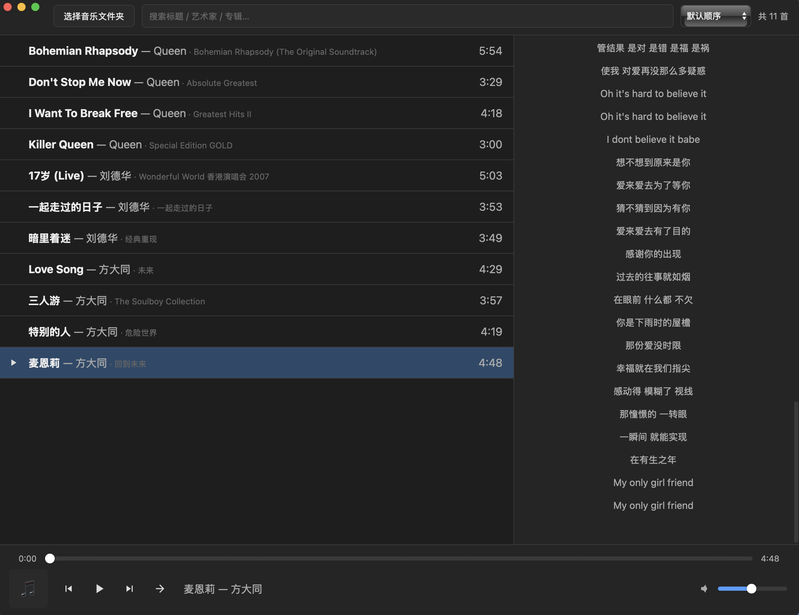

# LocalMusicApp

一个轻量、跨平台的本地音乐播放器，基于 Tauri + React 构建。



## 特性

- 🎵 **多格式支持**：mp3 / flac / m4a / aac / ogg / wav / alac
- 📁 **文件夹扫描**：自动读取音乐元数据（标题、艺术家、专辑、时长、封面）
- 🔍 **搜索与排序**：按标题 / 艺术家 / 专辑搜索，多种排序方式
- 🎼 **歌词显示**：自动匹配同名 `.lrc` 文件，支持 offset 校正
- ▶️ **完整播放控制**：进度拖动、音量、上一首/下一首
- 🔁 **播放模式**：顺序 / 列表循环 / 单曲循环
- 💾 **持久化**：记住上次的歌曲列表、音量、播放模式
- 🌓 **深色界面**：统一的设计风格
- 📦 **体积小**：借助 Tauri，安装包远小于 Electron 应用

## 截图

| 主界面 | 歌词 |
|---|---|
|  |  |

## 下载

前往 [Releases](../../releases) 页面下载对应平台的安装包：

- **Windows**：`.msi` 或 `-setup.exe`
- **macOS**：`.dmg`（Apple Silicon / Intel 两个版本）

> ⚠️ 未做代码签名，首次打开可能被系统拦截：
> - **Windows**：SmartScreen 提示时点"更多信息" → "仍要运行"
> - **macOS**：右键 app → "打开" → "仍要打开"

## 技术栈

| 层 | 技术 |
|---|---|
| 应用框架 | [Tauri 2](https://tauri.app/) |
| 前端 | React + TypeScript + Vite |
| 后端 | Rust |
| 音频解码 | [symphonia](https://github.com/pdeljanov/Symphonia) |
| 音频输出 | [rodio](https://github.com/RustAudio/rodio) |
| 元数据解析 | [lofty](https://github.com/Serial-ATA/lofty-rs) |
| 文件遍历 | [walkdir](https://github.com/BurntSushi/walkdir) |

## 为什么用 Tauri

相比 Electron，Tauri 复用系统自带的 WebView（macOS 用 WKWebView，Windows 用 WebView2），不打包浏览器内核，所以：

- 安装包小（几 MB ~ 十几 MB，而非上百 MB）
- 内存占用低
- 原生能力由 Rust 提供，性能好

音频解码放在 Rust 侧（symphonia），不依赖 WebView 的 `<audio>`，因此**各平台格式支持一致**。

## 本地开发

### 环境要求

- [Node.js](https://nodejs.org/) 18+
- [Rust](https://www.rust-lang.org/tools/install)（stable）
- 平台依赖：
  - **macOS**：Xcode Command Line Tools
  - **Windows**：Microsoft Visual Studio C++ Build Tools + WebView2
  - **Linux**：见 [Tauri 文档](https://tauri.app/start/prerequisites/)

### 运行

```bash
npm install
npm run tauri dev